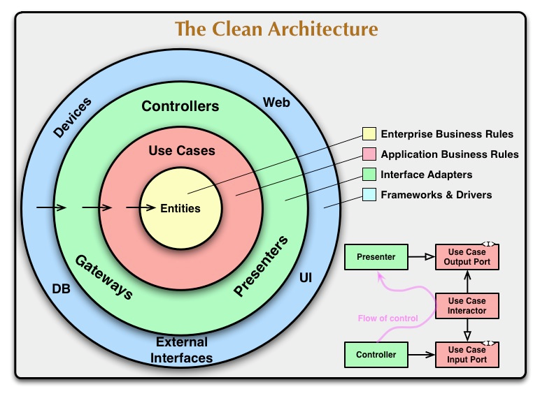

# grpc-auth-service

"grpc-auth-service" is a microservice for authorized users using a clean architecture.

### architecture



### config

```yaml
logger:
  is_json: true
  add_source: false
  level: debug
  set_file: false
  file_name: logs/app.log
  max_size: 10
  max_backups: 3
  max_age: 7

jwt:
  secret_path: testdata/fileServer/jwt/.secret # path to file with secret key
  secret_hash_len: 30
  access_exp_at: 5 # minutes
  refresh_exp_at: 30 # days

postgres:
  host: localhost
  user: auth
  password: auth
  dbname: auth_db
  port: 54321
  sslmode: disable
  pool_max_conns: 10
  migrations_dir: file://migrations

redis:
  addr: 127.0.0.1:63790
  password: auth
  db: 0
  dial_timeout: 5 # second
  read_timeout: 3 # second
  write_timeout: 3 # second
  pool_size: 10
  min_idle_conns: 3
  pool_timeout: 4 # second
  max_retries: 3
  min_retry_backoff: 8 # millisecond
  max_retry_backoff: 512 # millisecond

grpcserver:
  host: 127.0.0.1
  port: 50053
```

### start project:

```yaml
local:
  1) make install-deps
  2) make install-golangci-lint
  3) make get-deps
  4) make vendor-proto
  5) make generate-proto
  6) docker compose up -d
  7) go run cmd/app/main.go --config testdata/config.yaml
```